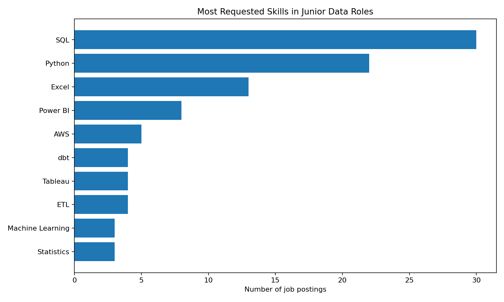
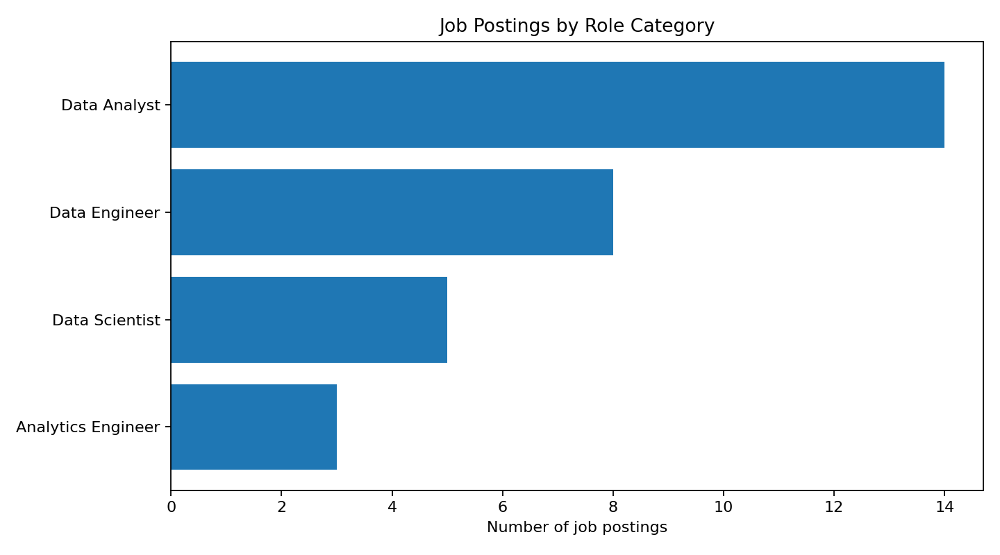
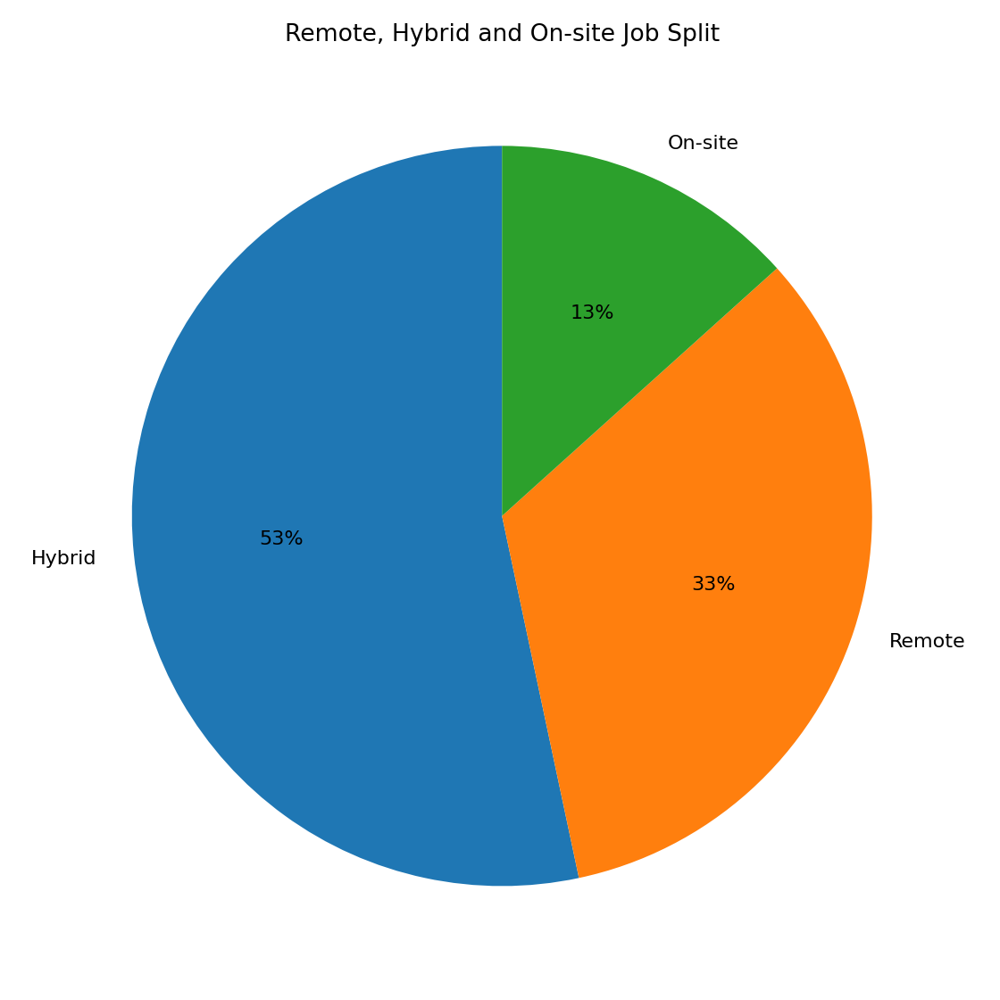
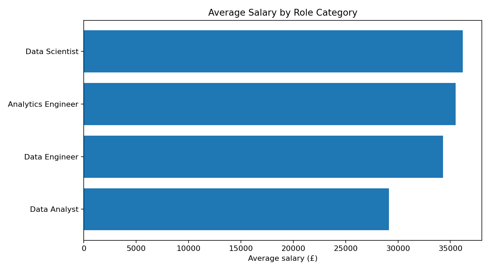
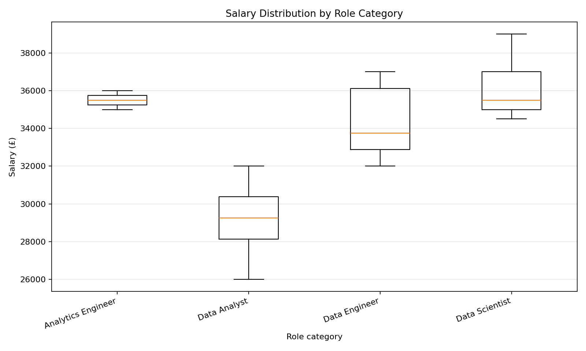
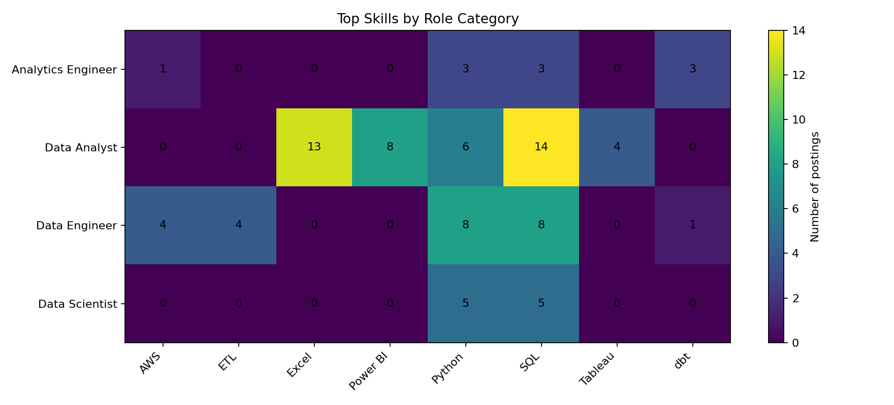

# Data Jobs Dashboard

A beginner-friendly data analysis and visualisation project exploring junior data job postings.

The project analyses a small sample dataset of junior data roles and creates dashboard-style charts showing role types, requested skills, work patterns and salary differences.

## Project Summary

This project is designed to answer practical questions for someone applying to junior data roles:

- Which skills appear most often?
- How common are data analyst, data engineer and data science roles?
- Are junior data jobs more often remote, hybrid or on-site?
- Which role categories have higher average salaries?
- How do requested skills differ by role type?

The dataset is a small synthetic/sample dataset created for portfolio practice. It is not intended to represent the full UK job market.

## Key Skills Demonstrated

- Cleaned and analysed tabular data with pandas
- Split multi-value skills into analyzable rows
- Created summary tables for roles, skills, locations and work types
- Built simple dashboard-style charts
- Compared skills across role categories
- Communicated findings clearly in a README

## Tools Used

- Python
- pandas
- matplotlib
- CSV data
- GitHub

## Project Structure

```text
.
├── data/                     # Sample job postings dataset
├── src/                      # Analysis script
├── outputs/
│   ├── charts/               # Generated dashboard charts
│   └── tables/               # Summary tables
├── docs/                     # Additional notes if needed
├── requirements.txt
└── README.md
```

## Dataset Columns

The dataset contains 30 sample junior data job postings with these fields:

- `job_id`
- `job_title`
- `company`
- `location`
- `work_type`
- `role_category`
- `salary_gbp`
- `skills`
- `posting_date`

## Key Insights

- The dataset contains 30 junior data job postings.
- **Data Analyst** is the most common role category in the sample, with 14 postings.
- **SQL** appears in every posting, making it the strongest core skill in this dataset.
- **Python** appears in 22 postings and is useful across analyst, engineering and data science roles.
- **Hybrid** is the most common work pattern, followed by remote roles.
- The average listed salary across the sample is approximately **£32,333**.
- Data engineering, analytics engineering and data science roles show higher average salaries than data analyst roles in this sample.
- **dbt** appears mainly in analytics engineering and data engineering roles, while **Excel** and **Power BI** appear more often in analyst-focused roles.

## Descriptive Statistics

This project uses descriptive analysis rather than formal statistical testing. Because the dataset is small and synthetic, statistical tests would not provide reliable evidence about the wider job market. Instead, the focus is on clear summaries that are appropriate for an exploratory dashboard.

Main descriptive metrics used:

- counts of postings by role category, location and work type
- skill frequency counts
- average, median, standard deviation, minimum and maximum salary by role category
- cross-tab style comparison of skills by role category

A simple next step, if using a larger real dataset, would be to compare salary distributions across role categories or test whether remote/hybrid roles are associated with different average salaries.

## Output Tables

The analysis script creates summary tables in `outputs/tables/`. These tables support the charts and make the analysis easier to inspect.

### `role_summary.csv`

This table summarises job count and salary by role category using basic descriptive statistics: mean, median, standard deviation, minimum and maximum. It shows that Data Analyst roles are the most common in the sample, while Data Scientist and Analytics Engineer roles have higher average salaries.

### `skill_counts.csv`

This table counts how often each skill appears across job postings. SQL appears in all 30 postings, followed by Python, Excel and Power BI. This suggests SQL and Python are the most useful skills to prioritise across junior data roles.

### `role_skill_counts.csv`

This table breaks skill demand down by role category. It helps show how skill expectations differ: dbt is more associated with analytics engineering, AWS and ETL appear more in data engineering, while Excel and Power BI are more common in analyst roles.

### `work_type_summary.csv`

This table counts remote, hybrid and on-site roles. Hybrid is the most common work pattern in the sample, but remote roles are also well represented.

### `location_summary.csv`

This table counts postings by location. UK-wide, Manchester and London appear most often in this sample.

## Charts

### Most Requested Skills

This chart shows the skills that appear most often across the 30 sample junior data job postings. It is designed to highlight which technical skills are most worth prioritising for junior applications.

**Main observation:** SQL appears in every posting, and Python is the second most common skill. Excel and Power BI are also common, especially for analyst-style roles.



### Role Category Breakdown

This chart shows how many postings belong to each role category. It helps show the balance of analyst, engineering, analytics engineering and data science roles in the sample dataset.

**Main observation:** Data Analyst roles are the largest group in the sample, which reflects why SQL, Excel and BI tools are strongly represented.



### Remote, Hybrid and On-site Split

This chart compares the working patterns listed in the sample postings. It is useful for understanding whether junior roles are more commonly remote, hybrid or office-based.

**Main observation:** Hybrid roles are the most common in the sample, followed by remote roles. Fully on-site roles are less common.



### Average Salary by Role

This chart compares average listed salary by role category. It gives a simple view of how salaries differ between junior data analyst, data engineering, analytics engineering and data science roles in the sample.

**Main observation:** Data Scientist, Analytics Engineer and Data Engineer roles have higher average salaries than Data Analyst roles in this sample.



### Salary Distribution by Role

This boxplot-style chart shows the spread of salaries within each role category. It adds a basic statistical view by showing not only average salary differences, but also the variation within each group.

**Main observation:** Data Analyst salaries are lower on average in this sample, while Data Scientist roles reach the highest maximum salary. Because the dataset is small and synthetic, this chart should be read as descriptive practice rather than evidence of real market salary differences.



### Top Skills by Role Category

This heatmap-style chart shows how frequently the top skills appear within each role category. It is designed to show how skill expectations differ across junior data roles.

**Main observation:** SQL and Python appear across most role types. dbt is more concentrated in analytics engineering, AWS/ETL are more relevant for data engineering, and Excel/Power BI are more common in analyst roles.



## Output Tables

The analysis script also creates summary CSV tables:

- `outputs/tables/skill_counts.csv`
- `outputs/tables/role_skill_counts.csv`
- `outputs/tables/role_summary.csv`
- `outputs/tables/work_type_summary.csv`
- `outputs/tables/location_summary.csv`
- `outputs/descriptive_statistics.md`
- `outputs/charts/salary_distribution_by_role.png`

## How to Run Locally

Create and activate a virtual environment:

```bash
python3 -m venv .venv
source .venv/bin/activate
```

Install requirements:

```bash
pip install -r requirements.txt
```

Run the analysis:

```bash
MPLCONFIGDIR=.cache/matplotlib XDG_CACHE_HOME=.cache python src/analyse_job_postings.py
```

## What I Practised

- Structuring a small data analysis project
- Cleaning a dataset for analysis
- Working with categorical data and multi-value skill fields
- Creating visual summaries for a dashboard-style README
- Writing clear insights for a non-technical audience

## Next Improvements

- Replace the sample dataset with real job posting data from a saved export
- Add an interactive Streamlit dashboard
- Add filters by location, role type and work pattern
- Track skill demand over time
